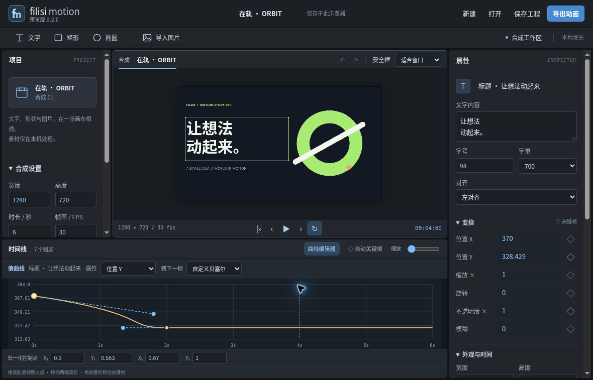

<div align="center">

# Filisi Motion

**让想法动起来。**

原创、开源、本地优先的二维动效编辑器。中文工作台，零运行时依赖。

[在线编辑器](https://thysummer14.github.io/filisi-motion/) · [使用指南](docs/USER_GUIDE.md) · [架构与边界](docs/ARCHITECTURE.md) · [许可与参考](docs/ACKNOWLEDGMENTS.md)

</div>

---



## 当前版本：0.3.1 开发预览版

这是向专业动效工具迈出的第一步，**不是完整的 After Effects 替代品**，也不读取 `.aep`。所有图形、界面与示例均为本项目原创；与 Adobe 无隶属关系。

### 可以完成什么

- **本机视频与音频**：媒体源入点、裁剪 / 拆分 / 移动、原声分离、音量与淡入淡出，WebM 原声混音。完整步骤见[视频工作流](docs/VIDEO_WORKFLOW.md)。
- **合成与图层**：自定义尺寸、帧率、时长；文字、矩形、椭圆、PNG / JPEG / WebP 图片；重排、复制、显隐与锁定。
- **画面编辑**：画布拖动，位置、缩放、旋转、不透明度、模糊；填充、圆角、字体大小、对齐和五种混合模式。
- **曲线编辑**：可拖动的数值曲线键点，自定义三次贝塞尔手柄、精确控制点输入，与预览/导出共享求值。
- **动画**：逐属性关键帧，线性 / 缓入 / 缓出 / 缓入缓出 / 保持；自动关键帧；可视化播放头、时间线拖动与裁剪、逐帧预览。
- **工程**：撤销 / 重做，本浏览器自动存档，可下载并重开 `.filisi` JSON 工程，图片与媒体以内嵌数据保存，可移植重开。
- **导出**：原合成尺寸 WebM 视频、逐帧 GIF 动图、当前帧 PNG。内置一段六秒原创示例。

### 明确的边界

不含变速、遮罩、路径编辑、父子关系、3D、表达式、插件系统或 MP4 编码。字体使用设备系统字体，不内嵌字体，跨设备排版可能不同。建议在桌面 Chrome / Edge 使用；尚不宣称 Safari 或所有 Mac 机型通过测试。

| 格式 | 工作方式 | 限制 |
| --- | --- | --- |
| WebM | Canvas + MediaRecorder，按合成尺寸实时录制 | 浏览器必须支持 WebM；保持页面前台；繁忙时可能丢帧、时长有小幅误差；部分播放器需读完才显示时长；可含混音轨 |
| GIF | 本项目原创 GIF89a 编码器，逐帧离线渲染 | 固定 RGB332 256 色；320 / 480 / 640 px 宽；10 / 12 / 15 fps；最多 600 帧、8000 万像素 |
| PNG | 当前播放头处渲染 | 单帧，无选框 |

工程上限：100 图层（媒体最多 32 片段），300 秒，3840 × 2160，60 fps；每张导入图片 10 MB，工程媒体合计 128 MB，工程导入 180 MB。这是安全上限，**不是这些规模下的流畅性能承诺**。开始建议使用 1280 × 720、6 秒、30 fps。

## 0.2 工作台

参考 [storytold / EffectCraft](docs/STORYTOLD_RESEARCH.md) 的实际工作台层级，重新安排紧凑工具条、全高属性栏和时间线 / 曲线面板，保留 Filisi 原创品牌。新 v2 工程格式可读取原来的 v1 文件；v2 文件需 0.2 或更新版打开。可以下载[贝塞尔练习工程](examples/orbit-bezier.filisi)查看已保存的控制点。

## 本地运行

需要 Node.js 20 或更新版本。没有 npm 安装步骤，也没有第三方运行时包。

```sh
git clone https://github.com/ThySummer14/filisi-motion.git
cd filisi-motion
npm run dev
```

打开终端打印的地址，默认 `http://127.0.0.1:4173`。不要直接双击 HTML：ES modules 需要 HTTP 服务。

```sh
npm run check   # JavaScript 语法检查与核心测试
npm run build   # 生成可部署的 dist/ 静态目录
```

任意静态 HTTP 服务器均可托管生成文件。不需要数据库、账号、云渲染服务或 API 密钥。

## 90 秒上手

1. 打开内置「在轨 · ORBIT」示例，按空格播放。
2. 选中文字，在右侧修改内容、字号与颜色。
3. 回到开头，点击「位置 X」旁的菱形。
4. 将播放头拖到两秒，修改位置 X；已有动画的属性会写入新关键帧。
5. 选中时间线上的菱形，在右侧切换缓动，拖动菱形改变时间。
6. 保存工程，再导出短片。详细步骤与快捷键见[使用指南](docs/USER_GUIDE.md)。

## 隐私与文件

编辑器本身不发送网络请求，不会上传导入素材或工程。媒体存在 IndexedDB，工程元数据存在当前站点的 LocalStorage；容量有限，清除浏览器数据会丢失。**请下载 `.filisi` 备份**。托管平台仍可能记录普通页面访问。项目文件可能包含你的图片，分享文件前请检查内容。

## 工程结构

```text
src/core.js        工程模型、插值、校验、历史快照
src/curve.js       原创贝塞尔求值、曲线边界
src/graph.js       值曲线编辑与手柄交互
src/render.js      Canvas2D 渲染、命中测试
src/gif.js         GIF89a / RGB332 / literal LZW 编码
src/app.js         编辑器交互、工程存取、导出调度
examples/          原创可编辑样片工程
tests/             Node 核心测试
scripts/           零依赖本地服务与静态打包
```

## 后续方向

以下是方向，**尚未实现**：可预测帧率的 WebCodecs / MP4 管线、媒体变速、代理、遮罩与路径、速度图与空间运动路径、字体管理，以及桌面封装。先把编辑、保存、渲染闭环做可靠，再扩大范围。

欢迎通过 Issue 提交可复现问题，附浏览器版本、步骤及脱敏后的最小工程。[贡献说明](CONTRIBUTING.md)。

## License

[MIT](LICENSE)。研究参考 Motionity、Motion Canvas 与 Friction，具体许可、未复用的范围与说明见[参考记录](docs/ACKNOWLEDGMENTS.md)。

