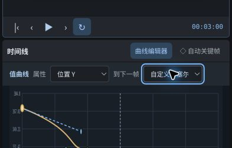
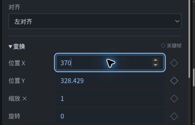

# 验证记录

## 2026-10-07 · 0.1 预览版

本记录区分实际浏览器操作、文件解码、核心测试，以及尚未覆盖的部分。测试在 Linux 云端 Chromium 进行，不代表真实 macOS / Safari 兼容性通过。

### 浏览器实际操作

- 线上 GitHub Pages 可加载；桌面约 1180 × 757 视口检查中文三栏工作台与可滚动时间线。
- 新建空白工程，设置 640 × 360、2 秒、24 FPS；输入中文文字，修改字号与位置。
- 为位置 X 创建 0 秒 / 1 秒两个关键帧（230 → 420），选择不同缓动；实际 UI 显示并保留数值。
- 画布拖动矩形，位置由 640 / 360 变为 735 / 449。
- 时间线拖动出点从 6 秒裁剪到 5 秒，再整体移动到 1–6 秒。
- 增加矩形的撤销 / 重做：7 → 8 → 7 → 8 个图层；时间线移动撤销 / 重做：入点 1 → 0 → 1 秒。
- 实际下载 `.filisi` 工程，独立解析与 schema round-trip 通过（示例 7 图层 / 24 关键帧）。
- 保存后刷新，浏览器自动存档恢复 8 图层；再次选择矩形确认 735 / 449、入点 1 秒、出点 6 秒保持不变。
- WebM 导出期间「开始导出」禁用，取消按钮可见；点击取消后显示「已取消导出」，可再次开始。

### 编辑器实际导出文件

| 检查 | WebM | GIF |
| --- | --- | --- |
| 内容 | 六秒原创 ORBIT 示例 | 同一 ORBIT 示例 |
| 尺寸 | 1280 × 720 | 320 × 180 |
| 编码 | VP9 / MediaRecorder | GIF89a / RGB332 |
| 请求帧率 | 30 FPS，实时尽力 | 12 FPS，离线逐帧 |
| 实际解码帧 | 165 | 72 |
| 时间 | 帧时间戳 0–5.989 秒 | 6.000 秒 |
| 验证 | FFmpeg 完整解码通过，并检查 1.7 秒画面 | FFprobe + Pillow 全帧解码，首末画面不同 |

WebM 样本证明导出不是静态占位，但也直接体现实时录制会丢帧，不能称作帧精确或专业成片管线。该 MediaRecorder 文件未提供可由 FFprobe 直接读取的总时长字段，时间以解码帧时间戳核实；部分播放器需要读完文件才显示时长。GIF 的帧数与总时长符合设置。

### 自动化核心测试

Node.js 24：11 项测试和语法检查通过；静态 build 通过。覆盖插值、保持缓动终点、关键帧替换、工程校验和 round-trip、危险图片引用拒绝、历史快照、变换命中、渲染不改变工程和 GIF 结构。

开发中测试发现并修复：保持缓动在下一关键帧处未切换值；示例中零缩放不符合输入校验；视频导出的取消 / 资源释放路径。视觉检查后收紧适合窗口的留白计算，避免画布容器无意义的滚动条。

### 尚未验证 / 不应推断

- 文件选择器的图片导入，以及下载工程经「打开」重新导入的完整浏览器路径。解析与校验通过不等于这些 UI 路径通过。
- Safari、真实 macOS、移动触摸、多张大图、长时间复杂工程或最大规格性能。
- 后台切换实际触发 `visibilitychange` 的路径。本云浏览器创建另一标签页未改变页面可见状态，因此只做了代码检查，不把它记为运行通过。
- PNG 下载、GIF 取消、全套混合模式与所有快捷键未逐项验收。

### 可复验

```sh
npm run check
npm run build
```

浏览器手工复验建议按「新建 → 两个关键帧 → 拖动 / 裁剪 → 撤销重做 → 保存 → 导出 → 解码」顺序进行。下载工程重开与图片导入是下一轮首先要补齐的验收项。

## 0.2 开发检查

- 新增 10 项曲线核心测试，合计 21 项通过，build 通过。涵盖时间反解、退化 / 交叉手柄、控制点校验、v1 迁移、贝塞尔存储、拖动边界、撤销重做。
- 实际桌面浏览器 1180 × 757 视口：新工具条、全高属性栏、时间线 / 曲线切换均显示；取样曲线与画面可同时查看。
- 真实拖动第一个贝塞尔手柄，参数从 `[0.33,0,0.67,1]` 变为 `[0.747,0.563,0.67,1]`；撤销 / 重做逐值复核。
- 真实拖动键点从 1.3 秒 / 304 到 2 秒 / 328.429，再撤销回原值；数值输入将 X₁ 调至 0.9。
- 锁定图层后曲线选择控件禁用。保存 v2 文件并独立 round-trip 验证；刷新恢复的控制点仍为 `[0.9,0.563,0.67,1]`。
- 修改曲线后的真实 GIF 导出：320 × 180、72 帧、6.000 秒，Pillow 全帧解码；第 12 帧与旧曲线样本不同。
- 修改曲线后的真实 WebM 导出：VP9、1280 × 720、134 实际帧，时间戳 0–6.006 秒，FFmpeg 全帧解码。再次说明请求 30 FPS 不等于帧精确输出。
- 窄屏通过浏览器缩放形成约 590 / 393 CSS px 视口；检查单列、曲线控件、堆叠属性。393 px 时文档宽度与 clientWidth 一致，没有页面级横向溢出。这是响应式布局检查，不是真机移动端或触控验收。已恢复浏览器 100% 缩放。
- 图片选择与工程文件选择的浏览器导入仍未验收，本轮没有借新功能绕过此前的文件选择限制。

### 0.2 实际截图

桌面截图来自在线编辑器，不是设计稿：


窄视口的两个局部截图（浏览器 300% 缩放，约 393 CSS px）：




## 0.3 视频 / 音频验收进行中

- 源码语法检查与 42 项 Node 测试通过；包括媒体时间数学、源边界、拆分连续性、淡入淡出包络、工程校验，以及异步加载 / 定位 / 停止 / 播放失败测试。运行时单元测试使用模拟 DOM，不能代替下面的实际浏览器验收。
- 在线桌面 Chrome 通过真实文件选择导入原创 4 秒、320 × 180、12 FPS 的 H.264 / AAC 测试卡。1.5 秒定位显示对应绿色帧，媒体状态回到就绪。
- 在 2 秒拆分；后段入点裁到 2.5 秒，源入点同步变为 2.5。再实际拖动后段到合成 2 秒，出点变为 3.5，源入点仍为 2.5。
- 将后段音量改为 0.5，撤销恢复 1，重做恢复 0.5。
- 保存的 v3 工程内嵌原始 26,581 字节测试片，SHA-256 与源文件一致。通过真实文件选择重开后再次保存，两份完整 JSON 逐字段相同，媒体回到就绪。
- 原片及上述编辑工程均实际导出 WebM。原片输出含 VP9 320 × 180 视频和 Opus 48 kHz 音频，FFmpeg 完整解码无错误。帧数、实际时间戳和音画偏移量仍待分析，不能仅由存在音轨宣称同步正确。
- 导出运行中开始按钮禁用；点击取消后显示「已取消导出」且按钮恢复，未下载半成品。
- 私人素材工作流、独立音频与效果闭环仍在验证。这里仅记录可公开的原创测试数据，不附带用户视频、歌曲或私人工程。仓库只有原创测试卡生成源码，不附带视频二进制。

### 0.3.1 音频边界实际回归

原创测试录制发现按画面帧循环关断音量可能泄漏切点之后的短声。已改为预排 Web Audio 增益曲线与片段终点静音，不再等待下一次画面刷新；新增时钟自动化回归测试。分离原声后自动选中新音轨，避免误改视频属性。在线 0.3.1 重新打开同一原创裁剪工程并真实录制，解码音轨后的脉冲只出现在约 0.01、1.01、2.54 秒（相对音轨起点）；错误的 2 秒脉冲消失。1.95–2.25 秒窗口最大 RMS 为 0.000027，后段正常脉冲 RMS 约 0.216，符合 0.5 音量。分离原声后实际检查属性面板自动选中 audio 类型且不再显示分离按钮；撤销回到原工程。

首次原片测试的实际 WebM 为 50 帧，末帧时间戳 4.156 秒；音轨解码 4.02 秒。画面与声音仍可能相差若干帧，音频边界修正不等于帧精确视频导出。

## 0.4 长时间轴开发中

75 项 Node 测试与静态 build 通过；新增工作集、跨切点音轨保留、旧加载释放、媒体未就绪防护、长刻度 / 视口，以及 24 项离线音频测试。真实长片、WAV 输出和布局回归尚待浏览器验收，不把模拟 API 结果当成实际解码或内存性能。

### 0.4.1 补充检查进行中

- 105 项测试通过，新增受限 MP4 AAC-LC 配置探测、阶段内存峰值、缓存保留 / 释放，以及解码声道超出预算的拒绝路径。
- 旧版真实浏览器已复现长轴定位后播放头移出视口，以及媒体复制造成额外 20px 空间偏移。修复后的真实回归与离线 WAV 验收仍在进行。

### 0.4.1 实机长项目重开修复中

在跨切点播放后，真实文件重开暴露了相同 SHA 素材被重新分配 Blob URL 的问题：旧解码器仍持有已撤销的 URL，可能定位超时。已改为相同内容复用原 Blob / URL，并继续写入持久化与更新元数据；新增 URL 生命周期回归测试。106 项 Node 测试通过，修正后的浏览器复验待完成。

本轮离线 WAV 已通过真实桌面 Chrome：原创 4 秒剪辑输出精确 192,000 个样本，切点与半音量检查通过；长音频输出按合成帧数换算出准确样本总量，参考解码对比最多差一个 PCM16 量化级。完整实测记录会在结束后补充。

## 0.4.1 最终实机记录（build2）

2026-10-07，在线桌面 Chrome。测试工程为 24 FPS、16 段串行视频与一条连续音轨；测试媒体未放入公开仓库。代码修复提交为 `37cfb3a05f6d24838c15731301adcdb5586cb046`。

- 10 次跨全时间轴定位全部就绪，耗时 22–267 ms；普通位置 3 个解码器，最后一镜 2 个。首次较大 JSON 导入后观察到约 84 MiB JavaScript 堆；刷新与定位阶段抽样约 4.8–8.0 MiB。这些数值不包含原生解码器，不是进程 RSS 或硬内存峰值。
- 20 倍缩放后定位 150 秒，播放头仍在可见视口内，刻度细化到合适帧间隔。视频复制保留画面中心与源入点，图层数由 17 变 18，撤销回 17。
- 在前、中、后部跨三个镜头切点短播放均继续推进、没有运行时播放错误。没有据此宣称完成所有浏览器或长片全程压力测试。
- 保存完整工程，真实文件选择重开，重新保存后的完整 JSON 与原始项目逐字段一致，内嵌素材保持一致。
- 最后一项实际测试暴露了同 SHA 素材重导入时撤销旧 URL 的问题。build2 复用相同内容的 Blob / URL 后，重复“末段播放 → 重开工程 → 0 / 5 / 150 秒定位”全部通过，定位耗时分别 21 / 36 / 97 ms，重保存 JSON 仍完全相同。导入瞬间观察到约 142 MiB JavaScript 堆，随后回落到约 4 MiB；未测得原生进程 RSS。

### 离线 WAV

- 原创 4 秒剪辑：实际输出 192,000 个 48 kHz 立体声样本，约 286 ms 完成。与独立解码参考对齐为 0 样本偏移，后段音量为前段一半，尾部精确静音。
- 长音频：实际输出 8,140,000 个样本、32,560,044 字节，约 2.35 秒完成。参考音轨有 8,139,520 个样本，最后 480 个输出样本准确静音，补齐合成多出的 10 ms。
- 对整段逐样本比较，同样增益的独立解码参考与输出相差最多一个 PCM16 量化单位；首、中、尾窗口均没有测得时间偏移或漂移。该结果仅覆盖本次 AAC-LC / Chrome 输入组合。
- 全曲取消流程显示取消终态、恢复按钮，未观察到半成品下载；执行期间开始按钮禁用。

这些音频结果来自 `OfflineAudioContext` WAV 路径，**不代表实时 WebM 的掉帧或音画差已经解决**。确定性视频编码 / 封装仍是下一阶段。Mac / Safari、真机触控、读屏和浏览器原生内存上限没有在本轮验证。
